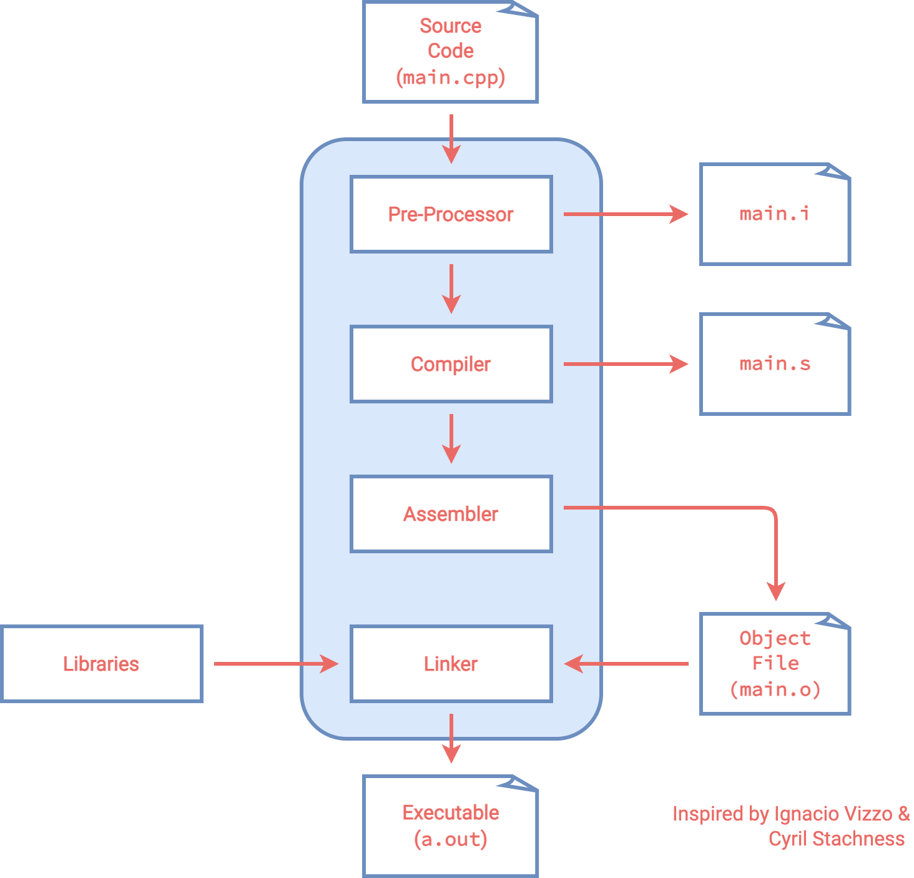
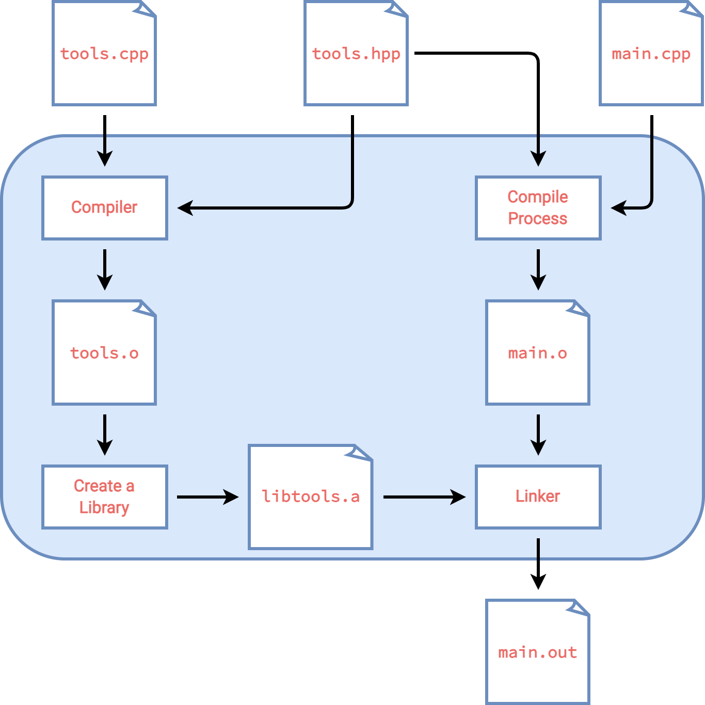

# BuildingCPP

Tutorial on the C++ building process and how to build using CMake. I believe the C++ building process has tortured many more than me, this tutorial is my attempt to solve that problem once and for all. I will first show the most basic version of compiling C++ code, then go through the compiling process, finally show how to compile projects using CMake.

## Compiling 101

Let's start with the `hello_world` example

```cpp
#include<iostream>

int main(){
    std::cout << "Hello World" << std::endl;
    return 0;
}
```

This can be compiled using 

```console
clang++ hello_world.cpp -o a.out

# or

g++ hello_world.cpp -o a.out
```

Here `clang++` and `g++` are two different compilers, `hello_world.cpp` specifies the name of the `.cpp` file that we want to compile, `-o` tag means we want to specify the name of the output executable, and `a.out` is the name of the executable that we chose. Run the command with the `hello_world.cpp` example in the `compiling_101` file and see if it works.

Now that we see how we can compile files, let's try to understand what is going on behind the scene.

## How the compiler works



When you compile the hello world example, four steps occurred

- Pre-process: `clang++ -E main.cpp > main.i`
- Compile: `clang++ -S main.i`
- Assembly: `clang++ -c main.s`
- Link: `clang++ main.o -o main`

The example files are shown in the `compile_process` folder.

### Pre-processor

The task of the pre-processor is to replace any line starting with `#` with the corresponding content. The most common one is the `#include` operation, which includes the corresponding header file within the `.i` file. We can see an example of this by creating two files

```cpp
// main.cpp
#include <iostream>

int main()
{
  std::cout << "Hello World" << std::endl;
  return 0;
}
```

and 

```cpp
// _main.cpp

int main()
{
  std::cout << "Hello World" << std::endl;
  return 0;
}
```

After we run

```console
clang++ -E main.cpp > main.i
clang++ -E _main.cpp > _main.i
```

We can see that `_main.i` only includes a few lines. On the other hand, `main.i` includes the lines in `_main.i` and in addition has all of the lines included from `<iostream>`. 

Another example is `bracket.cpp`. We first create a header file `bracket.h` that only includes a curly bracket. Then we replace the last curly bracket with the pre-processing operation `#include "bracket.h"`. If we then run

```console
clang++ -E bracket.cpp > bracket.i
```

we can see the curly bracket is restored within `bracket.i`. We also used the operation

```cpp
#define integer int
```

If we take a look at `bracket.i`, we can see all of the `integers` has been replaced with `int`. This shows that the job of the pre-processor is to only replace the `#` operations. Apart from `#include` and `#define`, we also have a few more pre-processing operations see [here](https://www.tutorialspoint.com/cplusplus/cpp_preprocessor.htm) for a description.

### Compiler

The job of the compiler is to transform the pre-processed C++ code into assembly code, which is easier to understand for the machine. Take a look at `main.s` for the assembly version of `main.cpp`.

### Assembler

The job of the assembler is to transform the assembly code into binaries (`.o` object file).

### Linker

The linker then links the object file and the libraries to generate the final executable.

## Libraries



A library is a collection of multiple object files that are logically connected. There are two types of libraries: static and dynamics.

- Static libraries (`lib*.a` files) are faster, but they take a lot of memory and becomes part of the final executable.
- Dynamic libraries (`lib*.so` files) are slower, but they can be copied and referenced by a program.

Usually, we would separte the declarations and implementations of a library. The declarations will usually be stored within a header file (`.hpp` file), while the implementations will be within a `.cpp` file. 

In the compilation process, the **header file** is used in the pre-processing phase. All of the declarations will be copied into the a single `.i` file, and an object file will be generated. Then, the linker will map the declarations to a compiled library object that contains their implementations. Thus, to use a library, we would need two things:

- header file `library_api.hpp`
- compiled library object `library_api.a`

Usually a `.a` file would include multiple `.o` files. The steps to compile `main.cpp` is as follows:

- compile the modules: `clang++ -std=c++17 -c tools.cpp -o tools.o`
- organize the modules into a library: `ar rcs libtools.a tools.o <other-modules>`
- link libraries when building the project: `clang++ -std=c++17 main.cpp -L . -ltools -o main`, where `-L <dir>` adds the directory to the library search path, and `-l<library-name>` is specifying the name of the library file. If `lib<name>.a` is the library object, then we use `-l<name>` for linking.

## Build & Metabuild Systems

Make and Ninja are build systems, CMake is a metabuild system. CMake generates makefiles that are given to build systems to actually build the project. So the usual workflow is

```console
mkdir build
cd build
cmake ../
make
```

To see what CMake does, we can write the CMake equivalence of 

```console
clang++ -std=c++17 -c tools.cpp -o tools.o
ar rcs libtools.a tools.o
clang++ -std=c++17 main.cpp -L . -ltools -o main
```

which is

```t
add_library(tools tools.cpp)
add_executable(main main.cpp)
target_link_library(main tools)
```

We can find a one-to-one correspondence between them. The `add_library(tools tools.cpp)` command corresponds to `clang++ -std=c++17 -c tools.cpp -o tools.o` and `ar rcs libtools.a tools.o`. The `add_executable(main main.cpp)` part corresponds to `clang++ -std=c++17 main.cpp -o main`. The `target_link_library(main tools)` part corresponds to `-L . -ltools`.

If you want to find an external library, you can use the `find_package` command. Note that the `find_package` command is looking for `Find<package>.cmake` files.

## Basic Installing Using CMake

We now talk about how to install packages using CMake. All of the source code in this section is in the `cmake_install` folder. 

Compared to the last section, in the C++ code all we changed is remove the reliance on `Eigen3` in `main.cpp`. What it means to install a package is to store the generated binary file, the header files, and the library files to some predefined location. To do this we add the following three lines in `CMakeLists.txt`

```cmake
install(TARGETS tools DESTINATION lib)
install(FILES include/tools.hpp DESTINATION include)
install(TARGETS main DESTINATION bin)
```

which is then installed using (only for CMake V3.15.0 and up, see [here](https://cmake.org/cmake/help/v3.24/guide/tutorial/Installing%20and%20Testing.html) for older versions)

```console
cmake --install .
```

We can see that the installation can be seperated into two types, installing targets and installing files. The targets are what is generated within the building process such as the library file `libtools.a` and the binary file `main`. The files are files that alread exists like the header file. The `DESTINATION` specifies where the installed files are stored at. The destinations are relative to a prefix directory, which can be specified when performing the installation using

```console
cmake --install . --prefix "/Users/BolunDai0216/Documents/BuildingCPP/cmake_install/install/"
```

and the files will then be installed within

```
/Users/BolunDai0216/Documents/BuildingCPP/cmake_install/install/bin/
/Users/BolunDai0216/Documents/BuildingCPP/cmake_install/install/include/
/Users/BolunDai0216/Documents/BuildingCPP/cmake_install/install/lib
```

## The Basic Way to Use Installed Packages

To use installed libraries the easiest way is to figure out where the header files and library files are located and just use them directly. The source code of this section can be found in the `cmake_use_installed_package_basic` folder.

First, to make our life easier we create a variable to store the location of the installation

```cmake
set(CUSTOM_INSTALLATION_DIR ${CMAKE_CURRENT_SOURCE_DIR}/../cmake_install/install)
```

We will be using the installed files from the last section, so the `CUSTOM_INSTALLATION_DIR` will be the `install` folder from last section. Then, like before we can include the header files as

```cmake
include_directories(${CUSTOM_INSTALLATION_DIR}/include/) 
```

Since we already have the library files (`.a` files), we would not need to run `add_library`, we can directly link the `.a` file using 

```
target_link_libraries(main ${CUSTOM_INSTALLATION_DIR}/lib/libtools.a)
```